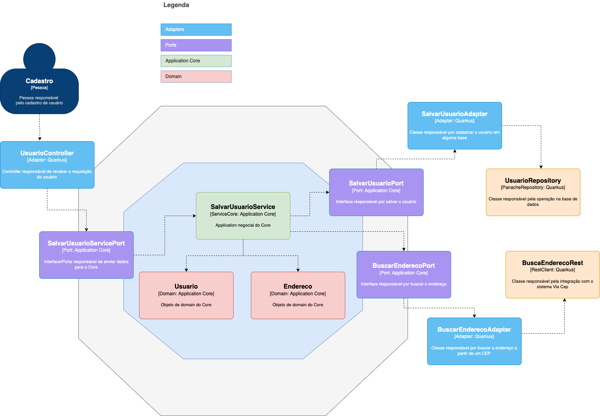

# Exemplo de arquitetura Hexagonal feita em Quarkus e Spring

Esse projeto foi feito para explicar melhor sobre a arquitetura Hexagonal, podendo ter sido feito com qualquer outra linguagem ou framework.

## Para rodar a app na sua máquina

Acesse o projeto de preferência e execute esse comando em sua IDE ou linha de comando preferida:
```shell script
./mvnw compile quarkus:dev
```
Veja a imagem de como está feita essa arquitetura em uma visão de componentes do C4 model

